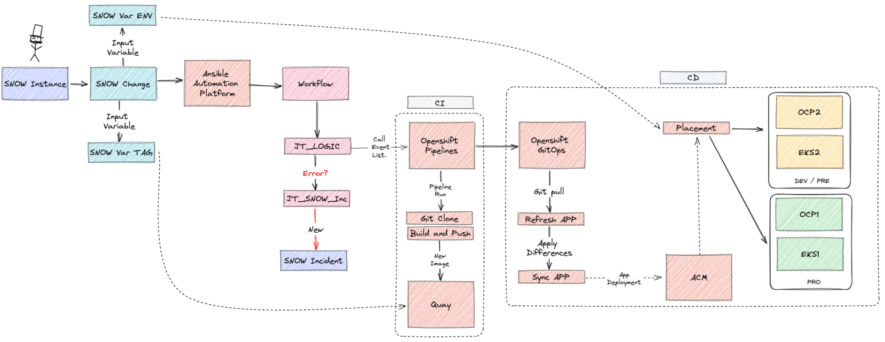

# Important initial considerations

In order to the content in the repo to be functional, all the content marked between the signs `<>` must be reviewed. The needed sensitive information can be vaulted using `ansible-vault`.

The idea behind this repo is to implement the following flow of things:



# SNOW-AAP-GitOps-OCP Demo

Repository to deploy Red Hat Ansible Automation Platform (AAP), Red Hat Openshift Pipelines (Tekton) and Red Hat Quay on Red Hat Openshift (OCP). It will be deployed an instance of an Private Automation Hub (PAH) and an instance of an Automation Controller (former Ansible Tower) on already deployed Openshift infraestructure. The OCP cluster is deployed in AWS and a shared filesystem is needed to deploy the PAH (which S3 is used in order to deploy it). It'll also deploy the Openshift Pipelines operator and an instance of the Quay operator (which also needs an S3 bucket).

> NOTE: This repository also contains Ansible Playbooks to create the needed Service Now (SNOW) objects as code (REST MESSAGE, Workflow and a Catalog Item with it's associated variables).

The repo contains the following things:

```
.
├── ansible.cfg                         (1)
├── bootstrap.yaml                      (2)
├── collections
│   └── requirements.yaml               (3)
├── gitops                              (4)
│   ├── applications                    
│   ├── bootstrap                       
│   └── installation                    
├── group_vars                          (5)
│   ├── all
│   ├── cluster1
│   ├── cluster2
│   └── snow
├── inventory                           (6)
├── playbooks
│   ├── 1_snow_rest_message.yaml        (7)
│   ├── 2_snow_workflow.yaml            (7)
│   ├── 3_snow_service_catalog.yaml     (7)
│   ├── snow_open_incident.yml          (7)
│   ├── check_web_app.yaml              (8)
│   ├── tasks
│   └── tekton.yaml                     (9)
├── README.md
└── templates                           (10)
    ├── add_aws_s3_secret_pah.yaml.j2
    ├── add_aws_s3_secret_quay.yaml.j2
    ├── add_gitops_demo_repo.yaml.j2
    └── patch_bgd_deployment.yaml.j2
```

> * (1) Ansible configuration file.
> * (2) Main bootstrap playbook to create the needed k8s objects and instances.
> * (3) Requirements file for the needed collections.
> * (4) Contents to be consumed by Openshift Gitops.
> * (5) Ansible variables for the different groups.
> * (6) Ansible inventory to define the different groups.
> * (7) Playbooks to deploy the required Service Now objects.
> * (8) Playbook to check the deployment of the application.
> * (9) Playbook to run the Openshift Pipeline.
> * (10) Templates used by the main bootstrap playbook.

## Packages required

```
$  python3 -m pip install ansible-navigator --user
$  python3 -m pip install ansible-builder --user
```
## Populate and encrypt your credentials and custom data

```
$ vim group_vars/cluster1/vault.yaml
$ vim group_vars/cluster2/vault.yaml
$ vim group_vars/all/main.yml
$ vim group_vars/snow/vault.yaml
$ vim group_vars/snow/snow_variables.yaml
$ ansible-vault encrypt group_vars/*/vault.yaml
```
## Create OCP object needed to deploy AAP, Pipelines and Quay

```
$ ansible-navigator run bootstrap.yaml -i inventory -l cluster1 -m stdout --eei quay.io/automationiberia/ee-ocp-aap-iac-casc --vault-password-file .vault_password
$ ansible-navigator run bootstrap.yaml -i inventory -l cluster2 -m stdout --eei quay.io/automationiberia/ee-ocp-aap-iac-casc --vault-password-file .vault_password
```
## Variables

|Variable Name|Default Value|Required|Description|Example|
|:---|:---:|:---:|:---|:---|
|`ocp_api_key`|n/a|yes|Token used to authenticate with the Openshift API|'sha256~Po6ydC7CVs12drESQeNiUW9poUT84aFrj7zL3VQfvrS'|
|`ocp_api_host`|n/a|yes|Provide a URL for accessing the Openshift API|'=https://api.cluster-ocp.lab.example.com:6443'|
|`ocp_api_validate_certs`|false|no|Whether or not to verify the API server’s SSL certificates|'true'|
|`aws_access_key`|n/a|yes|Amazon Access Key to access AWS API|'R767AKIFYSF5INA6QKB6'|
|`aws_secret_key`|n/a|yes|Amazon Secret Key to access AWS API|'qKCYpd/jQX6gRhucQwIT1d2lzrapZ/O4lpEKGGqR'|
|`aws_region`|n/a|yes|Amazon region where the S3 will be deploy it|'us-central-3'|
|`s3_bucket_name`|"n/a"|yes|Name of the S3 bucket that will be created and used by PAH|'hub-demo-bucket'|
|`s3_bucket_secret_pah_name`|"n/a"|yes|Name of the secret that will be used by PAH to access the S3 bucket |'s3-secret-automationhub'|
|`aap_ocp_namespace`|n/a|ansible-automation-platform|Name of the namespace where the AAP will be deployed|'ansible-automation-platform'|
|`quay_ocp_namespace`|n/a|quay-registry|Name of the namespace where the Quay will be deployed|'quay-registry'|
|`pipelines_ocp_namespace`|n/a|pipelines-demo|Name of the namespace where the Openshift Pipelines will be deployed|'pipelines-demo'|

# ToDo:

* Add the AAP CasC to deploy the needed objects:
    * Project
    * Job Templates
    * Workflow Job Template 