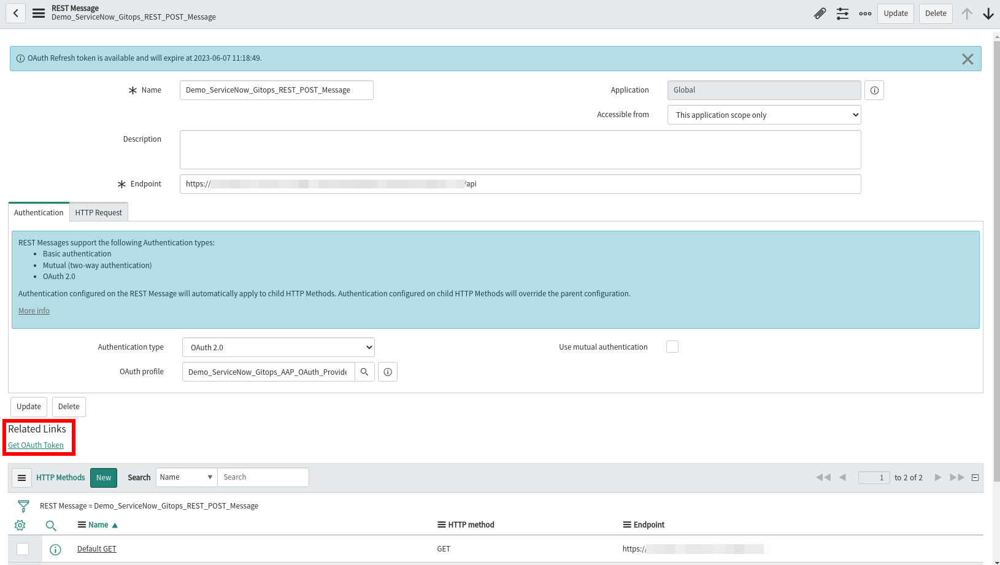

# Playbooks for Service Now Objects Creation

Three playbooks are provided to create the following objects:

* Rest Message
  * OAuth authentication profile
  * POST HTTP Method
    * Variable Substitutions
* Workflow
  * Workflow Activity
  * Workflow Conditions and Transitions
* Standard Change Catalog Item
  * Variable Sets with the input Vars
  * Process Engine to run the previous Workflow

These playbooks must be executed in the numbered order:

1. 1_snow_rest_message.yaml
2. 2_snow_workflow.yaml
3. 3_snow_service_catalog.yaml

After executing the first playbook, the REST Message object will be created or updated. As a result of this, the operation `Get OAuth Token` must be manually performed to let the REST Message to work properly:

# Playbook for Automation Process (Logic)

The playbook `tekton.yaml` is intended to contain all the automation logic to be executed from the Red Hat Ansible Automation Controller's Job template. In this demo, all the logic includes the following steps:

1. Clone the source code of the application from the git repository.
2. Build and push the new container image into the configured Quay repository. 
3. Force a refresh and a Sync process for the K8S application's manifests at Red Hat Openshift Gitops (ArgoCD).
4. Check that the application has been successfully re/deployed.
5. Promote the image to the following environment (as per the lifecycle definition).

The deployment of the application is controlled through the ACM K8S Placement object, which filters which clusters should deploy the application according to certain criteria.